# Haizlin-theme 博客模板

> Haizlin-theme 是我宝贝老婆业余时间给我设计的一套非常简洁的扁平化博客模板，支持Hexo，有结构清晰的设计图。  
> 以全屏为主，自适应移动端。  
> 如果你也喜欢这个主题，那就动动手指 [Star](https://github.com/haizlin/blog-theme/stargazers) 支持一下吧！  

## 设计图(PSD)
> 设计理念：

[查看](./docs/psd)

## 预览
[主题Blog预览](https://blog.haizlin.cn)

> 效果图，先睹为快  

- 首页([查看大图](https://raw.githubusercontent.com/haizlin/blog-theme/develop/docs/views/Home.png))  

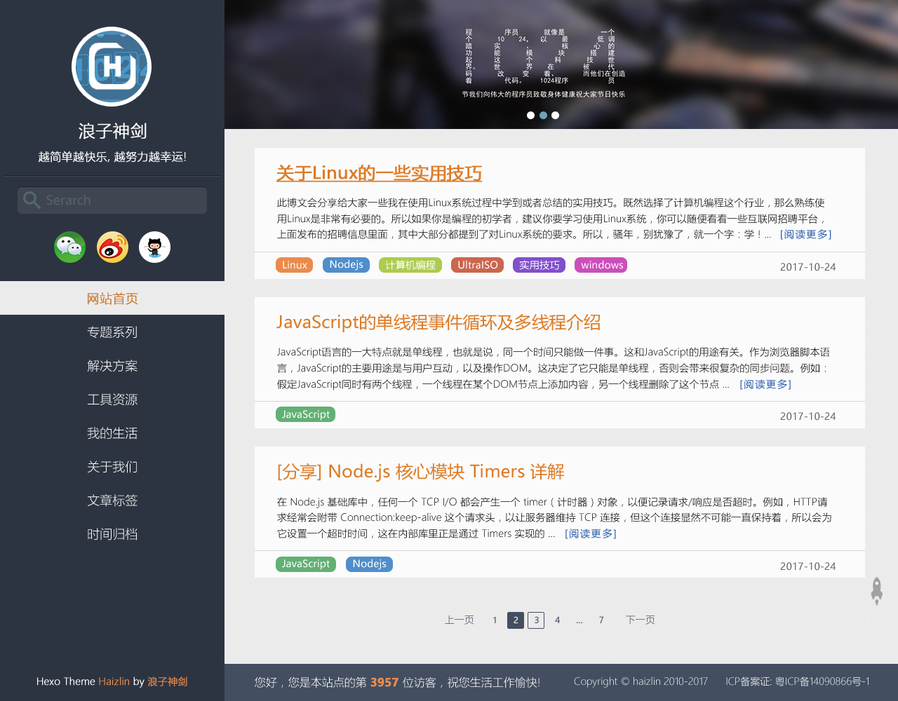

- 列表页([查看大图](https://raw.githubusercontent.com/haizlin/blog-theme/develop/docs/views/List.png))  

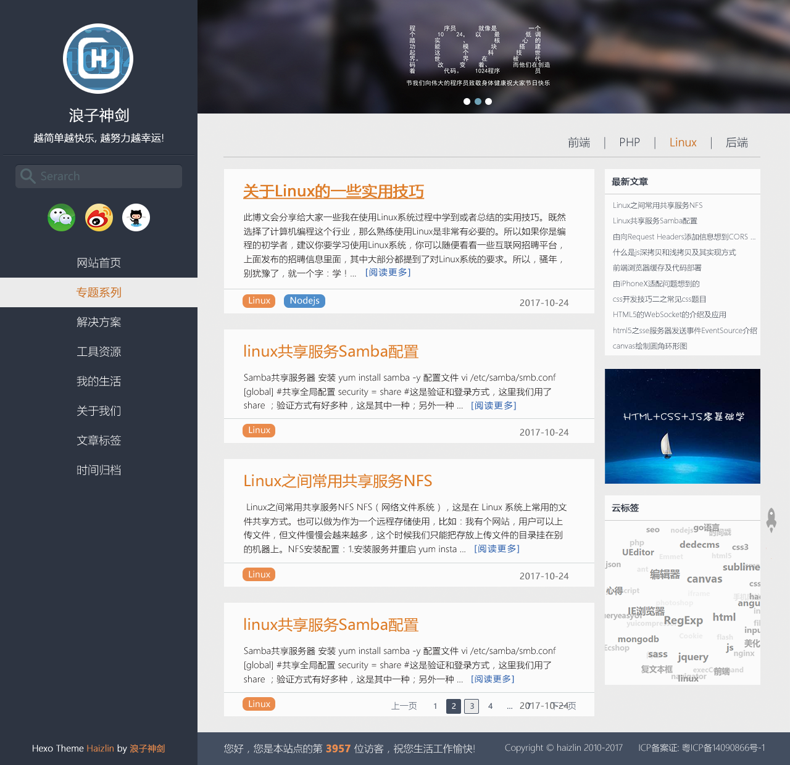

- 内容页([查看大图](https://raw.githubusercontent.com/haizlin/blog-theme/develop/docs/views/Content.png))  

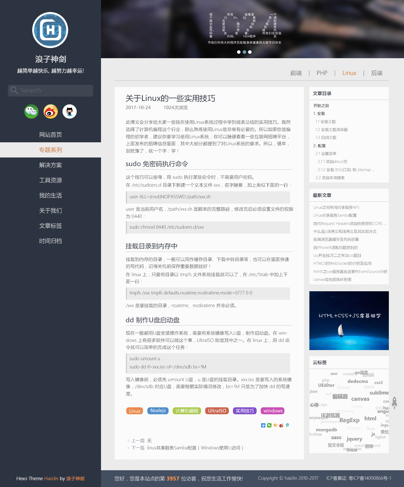

- 读书([查看大图](https://raw.githubusercontent.com/haizlin/blog-theme/develop/docs/views/Read.png))

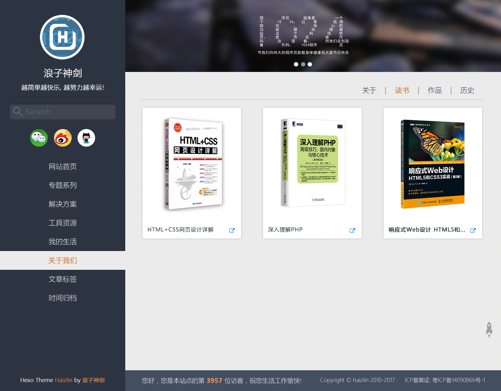

- 关于([查看大图](https://raw.githubusercontent.com/haizlin/blog-theme/develop/docs/views/About.png))

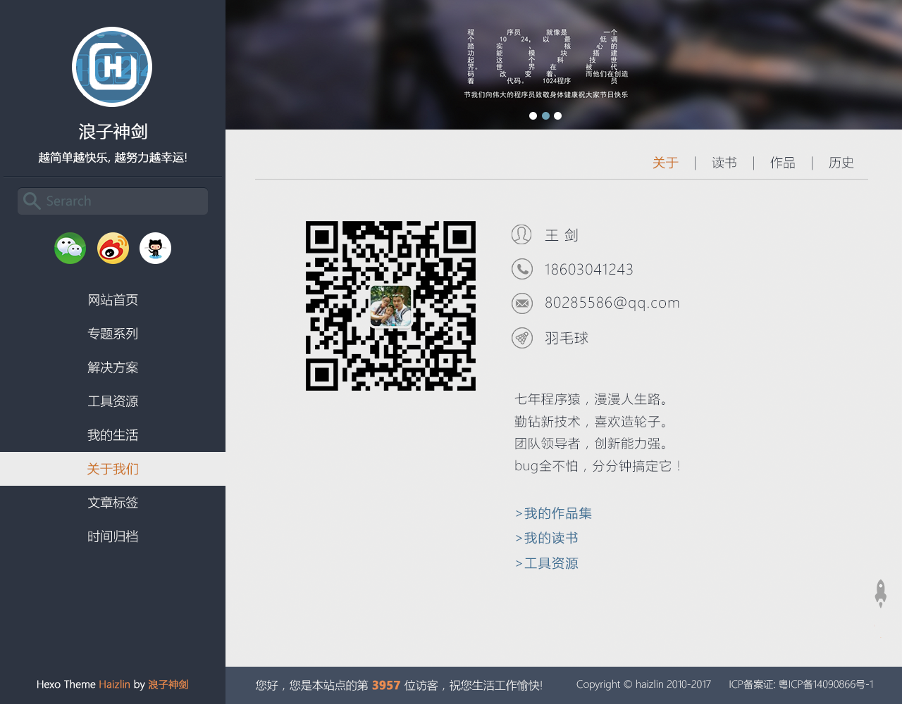

- 作品([查看大图](https://raw.githubusercontent.com/haizlin/blog-theme/develop/docs/views/Works.png))

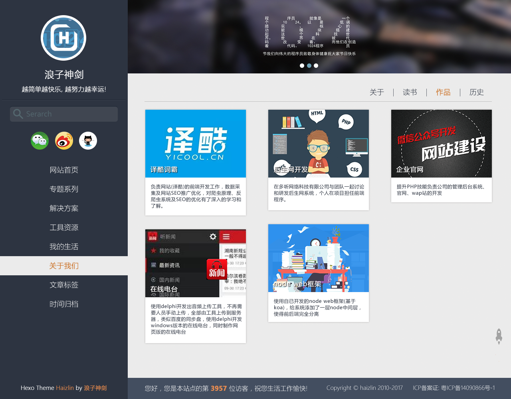

- 历史([查看大图](https://raw.githubusercontent.com/haizlin/blog-theme/develop/docs/views/History.png))

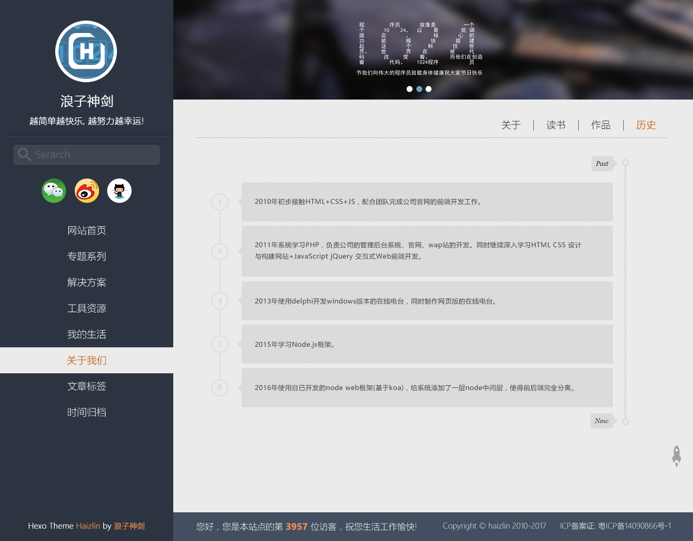

- 标签([查看大图](https://raw.githubusercontent.com/haizlin/blog-theme/develop/docs/views/Tags.png))

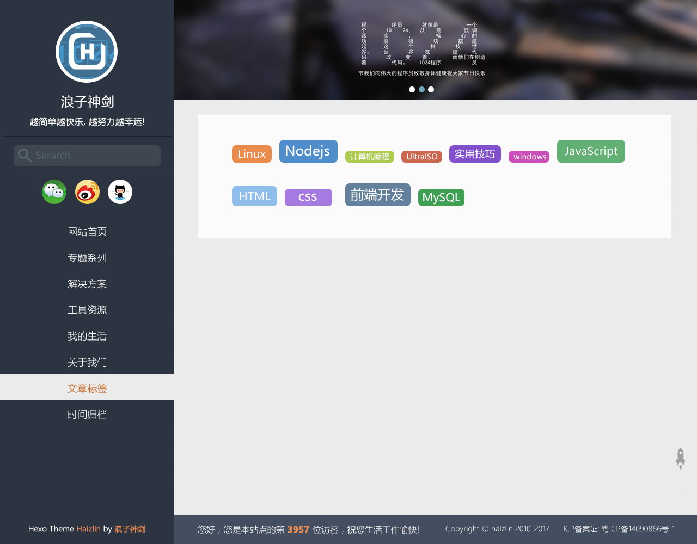

- 时间归档([查看大图](https://raw.githubusercontent.com/haizlin/blog-theme/develop/docs/views/Archives.png))

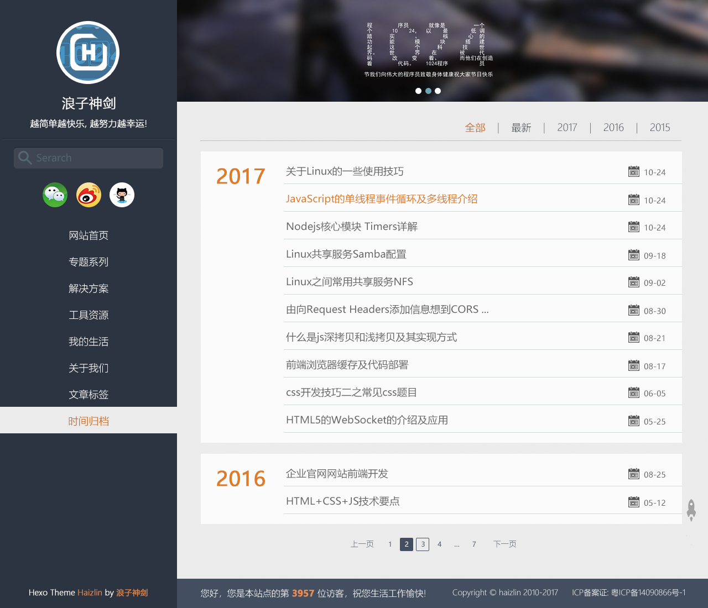

- 工具([查看大图](https://raw.githubusercontent.com/haizlin/blog-theme/develop/docs/views/Tools.png))

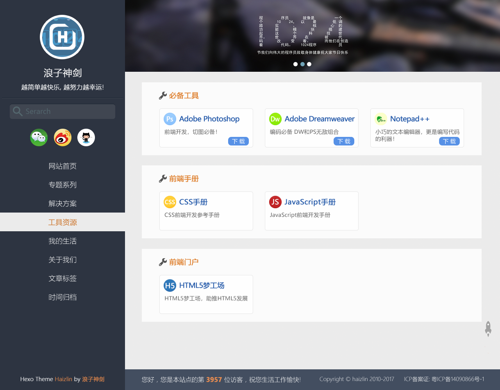

- 搜索([查看大图](https://raw.githubusercontent.com/haizlin/blog-theme/develop/docs/views/Search.png))

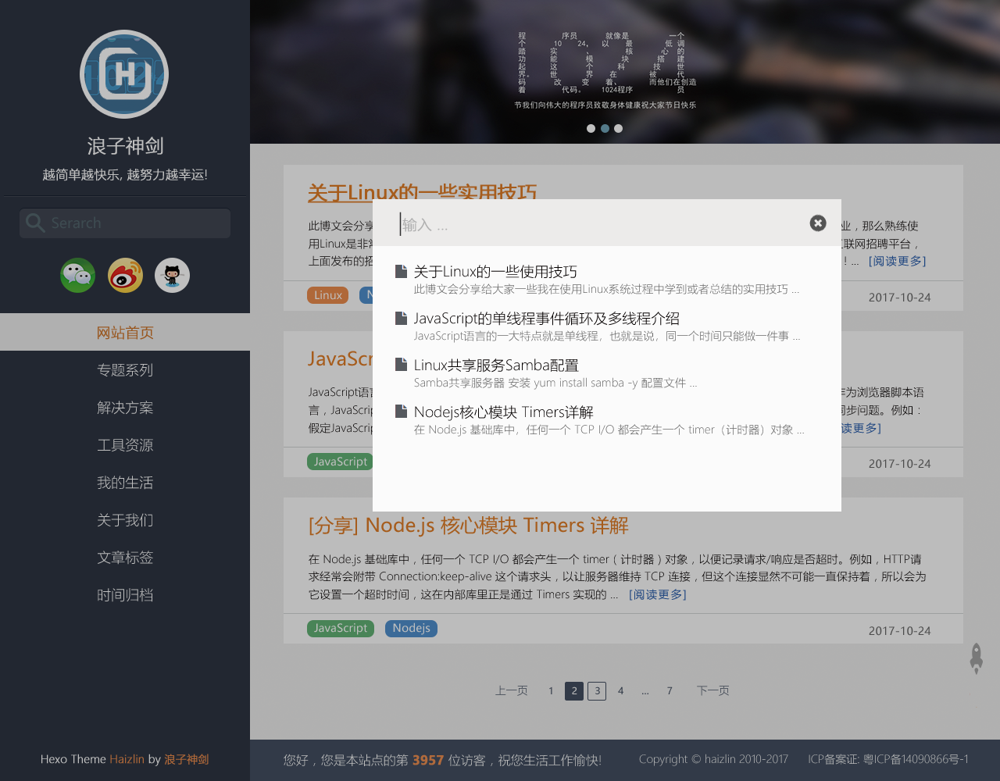

- 站点地图([查看大图](https://raw.githubusercontent.com/haizlin/blog-theme/develop/docs/views/Sitemap.png))

- 404([查看大图](https://raw.githubusercontent.com/haizlin/blog-theme/develop/docs/views/404.png))
> 使用了[腾讯公益](http://www.qq.com/404/)的404页面

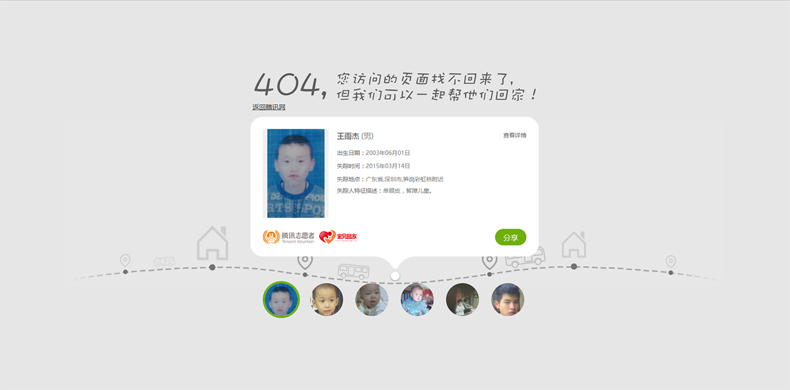

## 主题特点

- [x] 样式支持CSS预处理器scss，方便主题自定义
- [x] flex布局
- [x] 扁平化设计
- [x] 文章阅读进度条
- [x] 网站公告功能(使用了banner推荐网站公告)
- [x] 首页图片懒加载
- [x] 首页文章缩略图自动检索文章内图片，支持自动随机图片
- [x] 支持阅读进度条
- [x] 支持响应式
- [x] 对IE浏览器的检测和警告
- [x] 评论系统支持友言和Gitment
- [x] 版权信息可配置
- [x] 支持网站统计和文章推送
- [x] 移动端的简洁设计
- [x] 支持代码高亮并支持自定义高亮样式
- [x] 支持Shell脚本一键使用Travis CI持续部署Hexo博客

## 浏览器支持
本想支持IE6-IE8的，但后面觉得能进到这里来的估计只有技术员了吧，我相信做为一个合格的技术员都不愿意再使用IE6-IE8了，所以结论是只支持现代浏览器。

> Chrome/Firefox/Opera/Safari/IE9+  

## 使用

## 版本更新

### v1.0.0 (2017-11-06)
- 设计模板
- 初始化hexo基础功能

## License
[MIT](/LICENSE)
